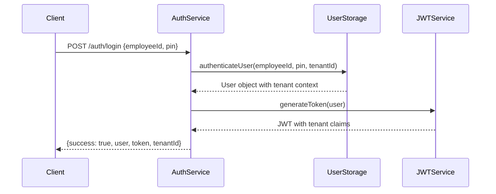
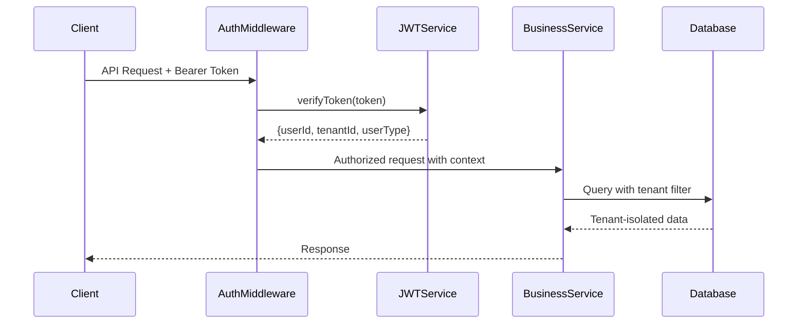

# SmartBite API - Enterprise Security Architecture

**Document Version**: 3.0  
**Last Updated**: August 24, 2025  
**System Status**: Enterprise Security Production Ready 🔒✅

## 🏗️ Executive Summary

The SmartBite API is a **enterprise-grade, multi-tenant, serverless** business management platform designed for restaurant and retail operations. Built on Azure Functions with a microservices architecture, it features **production-grade secure cookie authentication**, **CSRF protection**, **email-based user identification**, and **zero-localStorage security architecture** with complete tenant data isolation.

## 📋 Table of Contents

1. [System Overview](#-system-overview)
2. [Architecture Principles](#-architecture-principles)  
3. [Technology Stack](#-technology-stack)
4. [System Components](#-system-components)
5. [Multi-Tenant Architecture](#-multi-tenant-architecture)
6. [Data Flow & Security](#-data-flow--security)
7. [Authentication & Authorization](#-authentication--authorization)
8. [API Gateway & Routing](#-api-gateway--routing)
9. [Database Design](#-database-design)
10. [Deployment Architecture](#-deployment-architecture)
11. [Scaling Strategies](#-scaling-strategies)
12. [Security Implementation](#-security-implementation)
13. [Monitoring & Observability](#-monitoring--observability)
14. [Production Considerations](#-production-considerations)

---

## 🎯 System Overview

### Business Purpose
SmartBite API serves as the backend foundation for restaurant management operations, handling:
- **Cash Reconciliation**: Daily cash management and variance tracking
- **Employee Management**: User provisioning and role-based access
- **System Configuration**: Business rules and operational settings
- **Analytics & Reporting**: Business intelligence and operational insights

### Key Features
- **Multi-Tenant SaaS Architecture**: Support for multiple restaurant chains/businesses
- **Role-Based Access Control**: Employee, Manager, Owner permission levels
- **Real-Time Processing**: Immediate calculation and validation
- **Audit Trail**: Complete tracking of user actions and data changes
- **Serverless Scalability**: Automatic scaling based on demand

---

## 🎨 Architecture Principles

### 1. **Serverless-First Design**
- Azure Functions for compute operations
- Event-driven processing model
- Pay-per-execution cost model
- Automatic scaling and high availability

### 2. **Multi-Tenant by Design**
- Tenant isolation at data and application levels
- Shared infrastructure with data segregation
- Configurable business rules per tenant
- Cost-effective resource utilization

### 3. **Security-First Approach**
- JWT-based authentication with role validation
- Encrypted data transmission (HTTPS/TLS)
- Input validation and sanitization
- Audit logging for compliance

### 4. **Microservices Architecture**
- Domain-driven service boundaries
- Independent deployment capabilities
- Service-specific scaling
- Loose coupling with strong cohesion

### 5. **API-First Development**
- RESTful API design patterns
- Comprehensive OpenAPI documentation
- Consistent error handling
- Version management strategy

---

## 💻 Technology Stack

### **Backend Services**
- **Runtime**: Node.js 18+ with JavaScript ES6+
- **Platform**: Azure Functions v4 (Serverless)
- **Framework**: Azure Functions Core Tools
- **Authentication**: JSON Web Tokens (JWT)
- **Validation**: Joi schema validation

### **Data Layer**
- **Database**: Azure Cosmos DB (planned) / Mock Services (current)
- **Caching**: Azure Redis Cache (planned)
- **Storage**: Azure Blob Storage (for files/documents)
- **Search**: Azure Cognitive Search (planned)

### **Infrastructure**
- **Cloud Provider**: Microsoft Azure
- **Compute**: Azure Functions (Consumption Plan)
- **Networking**: Azure Virtual Network with private endpoints
- **Security**: Azure Key Vault for secrets management
- **Monitoring**: Azure Application Insights

### **Development & Deployment**
- **CI/CD**: GitHub Actions
- **Code Repository**: Git with GitHub
- **API Documentation**: Postman Collections + OpenAPI
- **Testing**: Jest (planned) + Postman automated tests

---

## 🧩 System Components

### **Core Services**

#### 1. **Authentication Service** (`/api/auth/*`)
**Purpose**: User authentication and session management
**Responsibilities**:
- PIN-based employee authentication
- JWT token generation and validation
- Session management and token refresh
- User profile retrieval

**Key Endpoints**:
```
POST /api/auth/login     - Employee authentication
GET  /api/auth/status    - Service status and demo credentials
GET  /api/auth/verify    - Token validation
POST /api/auth/logout    - Session termination
```

#### 2. **Employee Management Service** (`/api/employees/*`)
**Purpose**: User lifecycle and permission management
**Responsibilities**:
- Employee CRUD operations
- Role assignment and permission management
- User profile management
- Employee statistics and reporting

**Key Endpoints**:
```
GET    /api/employees           - List all employees
POST   /api/employees           - Create new employee (Owner only)
GET    /api/employees/{id}      - Get employee details
PUT    /api/employees/{id}      - Update employee (Owner only)
DELETE /api/employees/{id}      - Deactivate employee (Owner only)
```

#### 3. **Cash Reconciliation Service** (`/api/reconciliations/*`)
**Purpose**: Daily cash management and reconciliation workflow
**Responsibilities**:
- Cash reconciliation submission and processing
- Variance calculation and tolerance checking
- Manager approval workflow
- Historical reconciliation data

**Key Endpoints**:
```
GET  /api/reconciliations           - Get reconciliation history
POST /api/reconciliations           - Submit daily reconciliation
GET  /api/reconciliations/{id}      - Get specific reconciliation
PUT  /api/reconciliations/{id}      - Update reconciliation status (Manager+)
GET  /api/reconciliations/pending   - Get pending approvals (Manager+)
```

#### 4. **Configuration Management Service** (`/api/config/*`)
**Purpose**: System and business configuration management
**Responsibilities**:
- System configuration (registers, POS terminals)
- Business settings (tax rates, reconciliation rules)
- Tenant-specific configurations
- Configuration history and audit trail

**Key Endpoints**:
```
GET /api/config/system              - Get system configuration
PUT /api/config/system              - Update system config (Owner only)
GET /api/config/tenant/{tenantId}   - Get tenant configuration
GET /api/config/history             - Configuration change history
```

#### 5. **Analytics Service** (`/api/analytics/*`)
**Purpose**: Business intelligence and reporting
**Responsibilities**:
- Operational analytics and insights
- Performance metrics and KPIs
- Custom report generation
- Data visualization support

---

## 🏢 Multi-Tenant Architecture

### **Tenant Isolation Strategy**

The SmartBite API implements a **shared infrastructure, isolated data** multi-tenancy model:

#### **1. Tenant Identification**
```javascript
// Every user belongs to a tenant
{
  "userId": "employee-001",
  "tenantId": "tenant-restaurant-chain-abc", 
  "userType": "employee",
  "permissions": ["reconciliation"]
}
```

#### **2. Data Isolation Layers**

**Application Level Isolation**:
```javascript
// All database queries include tenant filter
const getUsersByTenant = (tenantId) => {
  return userStorage.filter(user => 
    user.tenantId === tenantId && user.isActive
  );
};

// JWT tokens include tenant context
const jwtPayload = {
  userId: user.id,
  tenantId: user.tenantId,  // Tenant isolation
  userType: user.userType,
  permissions: user.permissions
};
```

**Database Level Isolation** (Planned for Cosmos DB):
```javascript
// Partition key strategy for tenant isolation
{
  "partitionKey": "/tenantId",
  "documents": [
    {
      "id": "employee-001",
      "tenantId": "tenant-abc",  // Partition key
      "name": "John Smith",
      "data": { /* employee data */ }
    }
  ]
}
```

#### **3. Tenant Configuration Isolation**

Each tenant has independent configuration:
```javascript
{
  "tenantId": "tenant-restaurant-chain-abc",
  "businessConfig": {
    "name": "Pizza Palace Chain",
    "timezone": "America/New_York",
    "currency": "USD",
    "taxRate": 8.25
  },
  "operationalConfig": {
    "registers": { "count": 3, "names": ["Main", "Drive", "Backup"] },
    "reconciliation": {
      "dailyDeadline": "23:59",
      "varianceTolerance": 5.00,
      "requireManagerApproval": true
    }
  }
}
```

### **Client Data Separation Implementation**

#### **Current Implementation (Mock Data)**
```javascript
// Shared storage with tenant filtering
const sharedUserStorage = [
  { id: "emp-001", tenantId: "tenant-abc", name: "John", role: "employee" },
  { id: "emp-002", tenantId: "tenant-xyz", name: "Jane", role: "employee" },
  { id: "mgr-001", tenantId: "tenant-abc", name: "Mike", role: "manager" }
];

// Tenant-aware data access
const getEmployeesByTenant = (tenantId) => {
  return sharedUserStorage.filter(emp => emp.tenantId === tenantId);
};
```

#### **Production Implementation (Cosmos DB)**
```javascript
// Cosmos DB container with tenant partitioning
const cosmosConfig = {
  "database": "smartbite-production",
  "containers": [
    {
      "id": "users",
      "partitionKey": "/tenantId",  // Physical data separation
      "indexingPolicy": {
        "includedPaths": [
          { "path": "/tenantId/*" },
          { "path": "/userType/*" },
          { "path": "/isActive/*" }
        ]
      }
    },
    {
      "id": "reconciliations", 
      "partitionKey": "/tenantId",
      "ttl": 2592000  // 30 days retention
    },
    {
      "id": "configurations",
      "partitionKey": "/tenantId"
    }
  ]
};
```

---

## 🔄 Data Flow & Security

### **Authentication Flow**


### **Request Authorization Flow**


### **Data Access Patterns**

#### **Read Operations**
```javascript
// All queries include tenant context
async function getReconciliations(tenantId, filters) {
  return await reconciliationService.find({
    tenantId: tenantId,        // Mandatory tenant filter
    ...filters                 // Additional business filters
  });
}
```

#### **Write Operations**
```javascript
// All writes enforce tenant context
async function createReconciliation(data, userId, tenantId) {
  const reconciliation = {
    ...data,
    tenantId: tenantId,        // Enforce tenant assignment
    createdBy: userId,
    createdAt: new Date().toISOString()
  };
  
  return await reconciliationService.create(reconciliation);
}
```

---

## 🔒 Enterprise Authentication & Authorization

### **🚨 PRODUCTION SECURITY ARCHITECTURE**

#### **1. Secure Cookie Authentication (Enterprise-Grade)**
- **Email-Based Authentication**: Users login with email address (OpenID compatible)
- **User-Defined PINs**: 4 or 6 digit PINs created during signup
- **HttpOnly Secure Cookies**: Tokens inaccessible to JavaScript (XSS protection)
- **SameSite=Strict Policy**: CSRF attack prevention
- **1-Hour Sessions**: Automatic expiration with refresh capability
- **Zero localStorage**: No client-side token storage required

#### **2. CSRF Protection System**
- **Token-Based Protection**: One-time use CSRF tokens for state-changing operations
- **Session-Bound Tokens**: CSRF tokens tied to authenticated sessions
- **Automatic Cleanup**: Expired tokens automatically removed
- **Double-Submit Pattern**: Cookie + header verification
#### **3. JWT Token Structure (Secure Cookie Payload)**
```javascript
{
  "header": {
    "alg": "HS256",
    "typ": "JWT"
  },
  "payload": {
    "userId": "user@business.com", // Email-based user identification
    "userType": "owner", 
    "tenantId": "uuid-tenant-id",
    "name": "John Smith",
    "permissions": ["*"], // Owner has full access
    "sessionId": "uuid-session-id", // Unique session identifier
    "iat": 1756035837,
    "exp": 1756039437 // 1 hour expiration
  },
  "signature": "Sjsp8XeTeOGyesrW9fF0oZqgn2SJ4AWXGm9gw3pgXec"
}
```

### **Authorization Matrix**

| Resource | Employee | Manager | Owner |
|----------|----------|---------|-------|
| **Authentication** |
| Login/Logout | ✅ | ✅ | ✅ |
| **Reconciliations** |
| Submit Reconciliation | ✅ | ✅ | ✅ |
| View Own Reconciliations | ✅ | ✅ | ✅ |
| View All Reconciliations | ❌ | ✅ | ✅ |
| Approve/Reject | ❌ | ✅ | ✅ |
| **Employee Management** |
| View Employees | ✅ | ✅ | ✅ |
| Create/Update/Delete | ❌ | ❌ | ✅ |
| **Configuration** |
| View Configuration | ✅ | ✅ | ✅ |
| Update Configuration | ❌ | ❌ | ✅ |

---

## 🚪 API Gateway & Routing

### **Azure Functions Routing**

The system uses Azure Functions' built-in HTTP triggers with custom routing:

```javascript
// Function configuration
app.http('reconciliations', {
  methods: ['GET', 'POST', 'PUT', 'OPTIONS'],
  authLevel: 'anonymous',
  route: 'reconciliations/{id?}',
  handler: async (request, context) => {
    // Route handling logic
  }
});
```

### **Request Processing Pipeline**

1. **CORS Handling**: Pre-flight request processing
2. **Authentication**: JWT token validation
3. **Authorization**: Role-based access control
4. **Validation**: Input data validation with Joi
5. **Business Logic**: Core service processing
6. **Response**: Standardized JSON responses

### **Error Handling Strategy**

```javascript
// Standardized error responses
const errorResponse = {
  "success": false,
  "error": "Authentication required",
  "details": "Invalid or missing JWT token",
  "timestamp": "2025-08-20T06:22:09.642Z",
  "statusCode": 401
};
```

---

## 🗄️ Database Design

### **Current State: Mock Services**
```javascript
// In-memory data structures for development
const userStorage = [
  {
    id: 'employee-001',
    tenantId: 'tenant-001',
    name: 'John Smith',
    userType: 'employee',
    isActive: true,
    // ... additional fields
  }
];
```

### **Production State: Cosmos DB Design**

#### **Container Strategy**
```javascript
const containers = {
  // Users container - partitioned by tenantId
  "users": {
    "partitionKey": "/tenantId",
    "documents": [
      {
        "id": "employee-001",
        "tenantId": "tenant-restaurant-abc",
        "type": "user",
        "profile": {
          "name": "John Smith",
          "email": "john@restaurant-abc.com",
          "userType": "employee",
          "isActive": true
        },
        "security": {
          "pinHash": "$2b$10$...",
          "lastLogin": "2025-08-20T10:30:00Z",
          "failedAttempts": 0
        },
        "audit": {
          "createdAt": "2025-08-19T00:00:00Z",
          "createdBy": "owner-001",
          "updatedAt": "2025-08-20T09:15:00Z"
        }
      }
    ]
  },
  
  // Reconciliations container - partitioned by tenantId
  "reconciliations": {
    "partitionKey": "/tenantId",
    "documents": [
      {
        "id": "recon-20250820-employee-001",
        "tenantId": "tenant-restaurant-abc",
        "type": "reconciliation",
        "businessData": {
          "date": "2025-08-20",
          "employeeId": "employee-001",
          "status": "submitted",
          "calculations": {
            "totalSales": 2500.75,
            "variance": 5.25,
            "isBalanced": true
          }
        },
        "workflow": {
          "submittedAt": "2025-08-20T23:45:00Z",
          "requiresApproval": true,
          "approvedBy": null,
          "approvedAt": null
        }
      }
    ]
  },
  
  // Configurations container - partitioned by tenantId
  "configurations": {
    "partitionKey": "/tenantId",
    "documents": [
      {
        "id": "config-tenant-restaurant-abc",
        "tenantId": "tenant-restaurant-abc",
        "type": "system-config",
        "business": {
          "name": "Pizza Palace Chain",
          "timezone": "America/New_York",
          "currency": "USD",
          "taxRate": 8.25
        },
        "operational": {
          "registers": {
            "count": 3,
            "names": ["Main Register", "Drive Thru", "Backup"]
          },
          "reconciliation": {
            "dailyDeadline": "23:59",
            "varianceTolerance": 5.00,
            "requireManagerApproval": true
          }
        }
      }
    ]
  }
};
```

#### **Indexing Strategy**
```javascript
const indexingPolicy = {
  "includedPaths": [
    { "path": "/tenantId/*" },          // Partition key
    { "path": "/type/*" },              // Document type
    { "path": "/businessData/date/*" }, // Date queries
    { "path": "/businessData/status/*" }, // Status filtering
    { "path": "/audit/createdAt/*" }    // Temporal queries
  ],
  "excludedPaths": [
    { "path": "/businessData/calculations/*" }, // Large objects
    { "path": "/security/pinHash" }             // Security data
  ]
};
```

---

## 🚀 Deployment Architecture

### **Current Deployment: Azure Functions**

```yaml
# Azure Functions Configuration
functionApp:
  name: func-smartbite-reconciliation
  resourceGroup: smartbite-production
  location: East US
  runtime: node
  version: 18
  plan: Consumption
  
functions:
  - name: auth
    trigger: httpTrigger
    route: auth/{action?}
    
  - name: employees  
    trigger: httpTrigger
    route: employees/{employeeId?}
    
  - name: reconciliations
    trigger: httpTrigger
    route: reconciliations/{id?}
    
  - name: config
    trigger: httpTrigger
    route: config/{type?}/{tenantId?}
```

### **Infrastructure as Code** (Planned)

```yaml
# Azure Resource Manager Template
resources:
  - type: Microsoft.Web/sites
    name: smartbite-functions
    properties:
      serverFarmId: consumption-plan
      httpsOnly: true
      
  - type: Microsoft.DocumentDB/databaseAccounts  
    name: smartbite-cosmos
    properties:
      databaseAccountOfferType: Standard
      consistencyPolicy:
        defaultConsistencyLevel: Session
        
  - type: Microsoft.KeyVault/vaults
    name: smartbite-secrets
    properties:
      tenantId: ${tenantId}
      accessPolicies: []
```

### **Environment Configuration**

```javascript
// Environment-specific configurations
const environments = {
  development: {
    cosmosEndpoint: "https://localhost:8081",
    jwtSecret: "dev-secret-key",
    logLevel: "debug"
  },
  staging: {
    cosmosEndpoint: "${COSMOS_STAGING_ENDPOINT}",
    jwtSecret: "${JWT_SECRET_STAGING}",
    logLevel: "info"  
  },
  production: {
    cosmosEndpoint: "${COSMOS_PRODUCTION_ENDPOINT}",
    jwtSecret: "${JWT_SECRET_PRODUCTION}",
    logLevel: "warn"
  }
};
```

---

## 📈 Scaling Strategies

### **Horizontal Scaling**

#### **Azure Functions Auto-Scaling**
- **Consumption Plan**: Automatic scaling based on demand
- **Premium Plan**: Pre-warmed instances for consistent performance
- **Cold Start Mitigation**: Keep-warm strategies for critical functions

#### **Database Scaling**
```javascript
// Cosmos DB scaling configuration
const cosmosScaling = {
  "throughput": {
    "manual": 400,      // RU/s for development
    "autoscale": {
      "maxThroughput": 4000,  // Production auto-scaling
      "targetUtilization": 70
    }
  },
  "partitioning": {
    "strategy": "tenantId",   // Distribute by tenant
    "hotPartitionMitigation": true
  }
};
```

### **Performance Optimization**

#### **Caching Strategy**
```javascript
// Redis caching for frequently accessed data
const cacheStrategy = {
  "userProfiles": {
    "ttl": 3600,        // 1 hour
    "pattern": "user:{tenantId}:{userId}"
  },
  "configurations": {
    "ttl": 86400,       // 24 hours  
    "pattern": "config:{tenantId}"
  },
  "reconciliationStats": {
    "ttl": 300,         // 5 minutes
    "pattern": "stats:{tenantId}:{date}"
  }
};
```

#### **Connection Pooling**
```javascript
// Cosmos DB connection optimization
const cosmosClient = new CosmosClient({
  endpoint: process.env.COSMOS_ENDPOINT,
  key: process.env.COSMOS_KEY,
  connectionPolicy: {
    maxRetryWaitTimeInMs: 5000,
    maxRetryAttemptsOnThrottledRequests: 10,
    connectionPoolSize: 10
  }
});
```

---

## 🔒 Security Implementation

### **Data Protection**

#### **Encryption Strategy**
- **In Transit**: HTTPS/TLS 1.2+ for all communications
- **At Rest**: Azure Cosmos DB automatic encryption
- **Application Level**: Sensitive data hashing (PINs, passwords)

#### **Secret Management**
```javascript
// Azure Key Vault integration
const keyVaultSecrets = {
  "jwt-signing-key": "${KEY_VAULT_JWT_SECRET}",
  "cosmos-connection": "${KEY_VAULT_COSMOS_CONNECTION}",
  "encryption-key": "${KEY_VAULT_ENCRYPTION_KEY}"
};
```

### **Input Validation**
```javascript
// Joi validation schemas
const schemas = {
  login: Joi.object({
    employeeId: Joi.string().pattern(/^[a-z]+-\d{3}$/).required(),
    pin: Joi.string().min(4).max(9).required()
  }),
  reconciliation: Joi.object({
    date: Joi.date().iso().required(),
    totalSales: Joi.number().positive().required(),
    // ... additional validation rules
  })
};
```

### **Audit Logging**
```javascript
// Comprehensive audit trail
const auditLog = {
  "eventId": "uuid-v4",
  "tenantId": "tenant-abc",
  "userId": "employee-001", 
  "action": "reconciliation.submit",
  "resource": "reconciliation-20250820",
  "timestamp": "2025-08-20T23:45:00Z",
  "ipAddress": "192.168.1.100",
  "userAgent": "PostmanRuntime/7.28.4",
  "result": "success"
};
```

---

## 📊 Monitoring & Observability

### **Application Insights Integration**

```javascript
// Telemetry configuration
const telemetryConfig = {
  "instrumentationKey": "${APP_INSIGHTS_KEY}",
  "customMetrics": [
    "reconciliation.submission.count",
    "authentication.failure.rate", 
    "api.response.time.p95"
  ],
  "customEvents": [
    "user.login",
    "reconciliation.approved",
    "configuration.updated"
  ]
};
```

### **Health Check Endpoints**
```javascript
// System health monitoring
app.http('health', {
  route: 'health',
  handler: async (request, context) => {
    const health = {
      status: 'healthy',
      timestamp: new Date().toISOString(),
      services: {
        authentication: await checkAuthService(),
        database: await checkDatabaseConnection(),
        cache: await checkCacheConnection()
      }
    };
    return { jsonBody: health };
  }
});
```

### **Performance Metrics**
- **Response Time**: P50, P95, P99 percentiles
- **Throughput**: Requests per second by endpoint
- **Error Rate**: 4xx/5xx error percentages  
- **Availability**: Uptime and health check status

---

## 🎯 Production Considerations

### **Migration Strategy from Mock to Cosmos DB**

#### **Phase 1: Database Setup**
1. **Provision Cosmos DB**: Create account and containers
2. **Data Migration**: Migrate mock data to Cosmos DB
3. **Connection Configuration**: Update connection strings
4. **Testing**: Validate data integrity and performance

#### **Phase 2: Code Migration**
```javascript
// Database abstraction layer
class DataService {
  constructor(useCosmosDB = false) {
    this.provider = useCosmosDB 
      ? new CosmosDBProvider() 
      : new MockDataProvider();
  }
  
  async getUsers(tenantId) {
    return await this.provider.getUsers(tenantId);
  }
}
```

#### **Phase 3: Production Deployment**
1. **Environment Setup**: Configure production environment
2. **Security Configuration**: Set up Key Vault and secrets
3. **Monitoring Setup**: Configure Application Insights
4. **Load Testing**: Validate performance under load

### **Tenant Onboarding Process**

#### **New Tenant Setup**
```javascript
// Automated tenant provisioning
async function provisionNewTenant(tenantData) {
  const tenantId = generateTenantId(tenantData.businessName);
  
  // 1. Create tenant configuration
  await configService.createTenantConfig(tenantId, {
    business: tenantData.businessConfig,
    operational: getDefaultOperationalConfig()
  });
  
  // 2. Create initial owner user
  const ownerUser = await userService.createUser({
    tenantId: tenantId,
    userType: 'owner',
    name: tenantData.ownerName,
    email: tenantData.ownerEmail
  });
  
  // 3. Set up default permissions
  await permissionService.setupDefaultPermissions(tenantId);
  
  return {
    tenantId: tenantId,
    ownerCredentials: ownerUser.credentials,
    setupComplete: true
  };
}
```

### **Data Backup & Recovery**

#### **Backup Strategy**
```javascript
const backupConfig = {
  cosmos: {
    pointInTimeRestore: true,
    backupInterval: "24h",
    retentionPeriod: "30d"
  },
  applicationData: {
    exportSchedule: "daily",
    format: "json",
    encryption: true,
    storage: "azure-blob"
  }
};
```

### **Disaster Recovery Plan**

1. **RTO (Recovery Time Objective)**: 2 hours
2. **RPO (Recovery Point Objective)**: 1 hour
3. **Multi-Region Deployment**: Primary: East US, Secondary: West US
4. **Automated Failover**: DNS-based traffic routing

---

## 🔮 Future Enhancements

### **Short Term (Next 3 Months)**
- [ ] **Cosmos DB Integration**: Replace mock data with production database
- [ ] **Redis Caching**: Implement caching layer for performance
- [ ] **Application Insights**: Full observability implementation
- [ ] **Automated Testing**: Unit and integration test suites

### **Medium Term (3-6 Months)**  
- [ ] **Multi-Region Deployment**: Geographic distribution for performance
- [ ] **Advanced Analytics**: Machine learning for reconciliation insights
- [ ] **Mobile API Optimization**: Enhanced mobile app support
- [ ] **Audit Dashboard**: Real-time audit log visualization

### **Long Term (6-12 Months)**
- [ ] **OpenID Connect Integration**: Enterprise SSO support
- [ ] **Microservices Decomposition**: Further service isolation
- [ ] **Event-Driven Architecture**: Azure Service Bus integration
- [ ] **Advanced Security**: Zero-trust security model

---

## 📞 Support & Maintenance

### **Operational Runbooks**
- **Incident Response**: Escalation procedures and contact information
- **Deployment Process**: Step-by-step deployment instructions
- **Monitoring Alerts**: Alert configuration and response procedures
- **Performance Tuning**: Optimization guidelines and best practices

### **Documentation Maintenance**
- **API Documentation**: Automated OpenAPI generation
- **Architecture Updates**: Regular review and updates to this document
- **Security Reviews**: Quarterly security assessment and updates
- **Performance Reviews**: Monthly performance analysis and optimization

---

**Document Control**
- **Author**: SmartBite Development Team
- **Review Cycle**: Quarterly
- **Next Review**: November 20, 2025
- **Approval**: Solution Architect, Lead Developer, Security Officer

---

*This document is version controlled and maintained as part of the SmartBite API project documentation. For the latest version, refer to the project repository.*